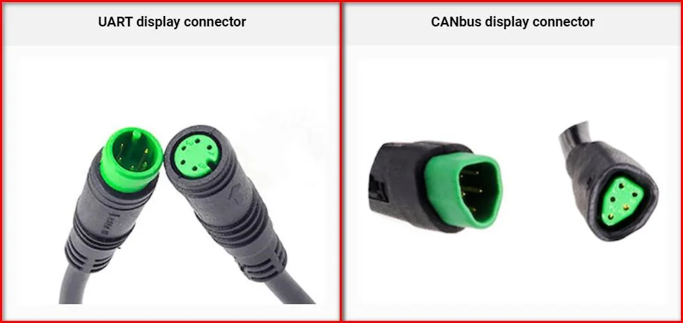
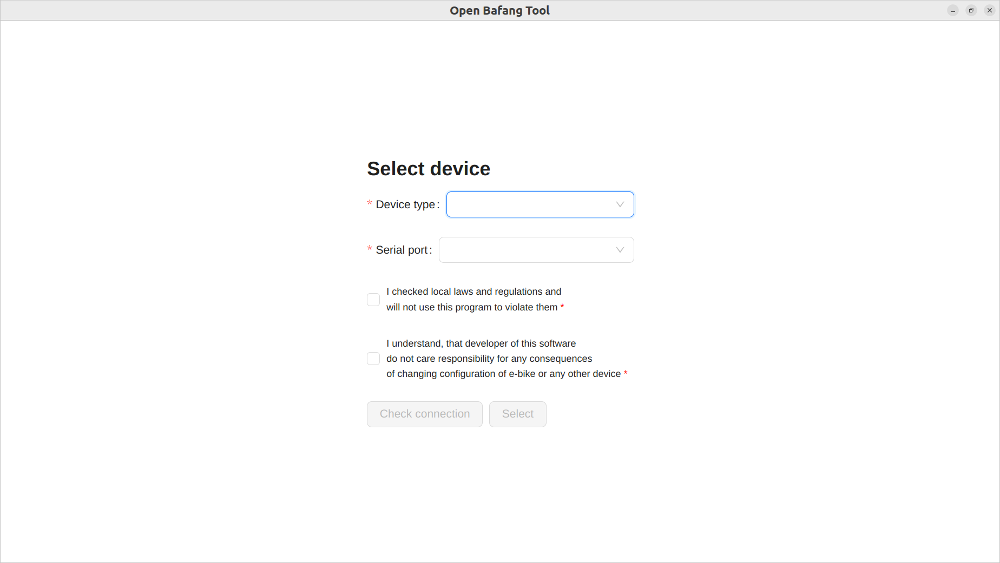
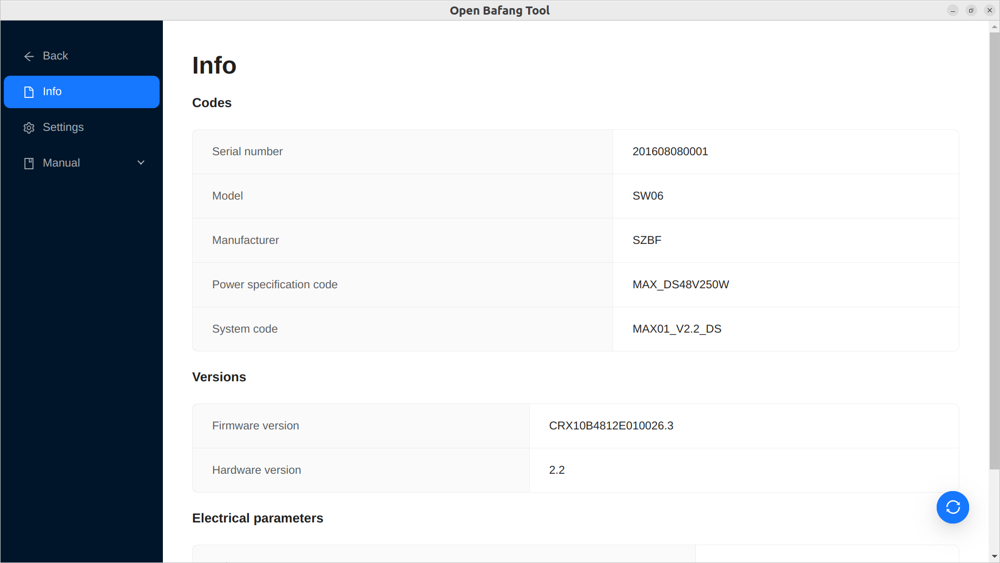
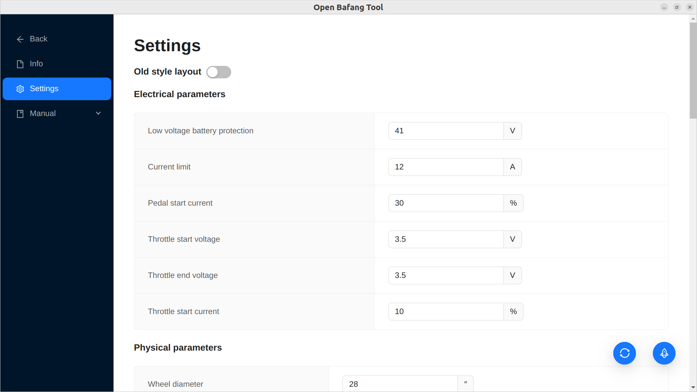
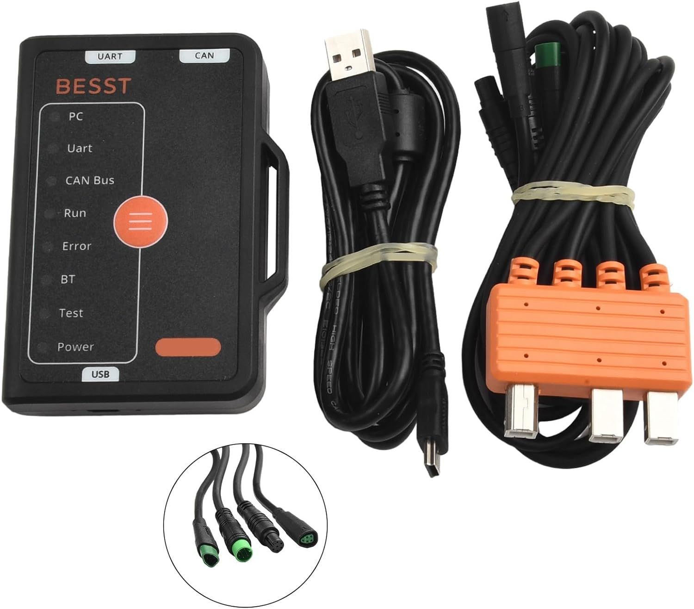
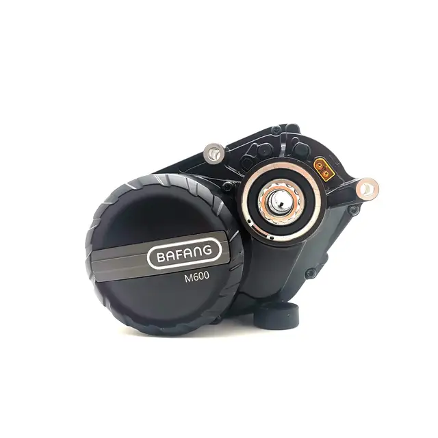
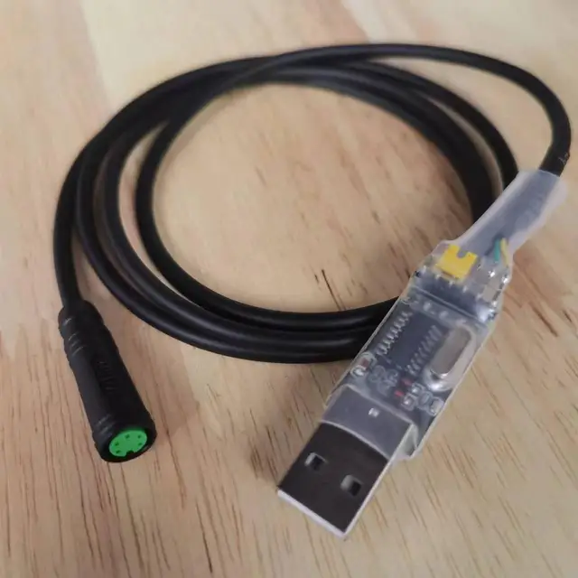
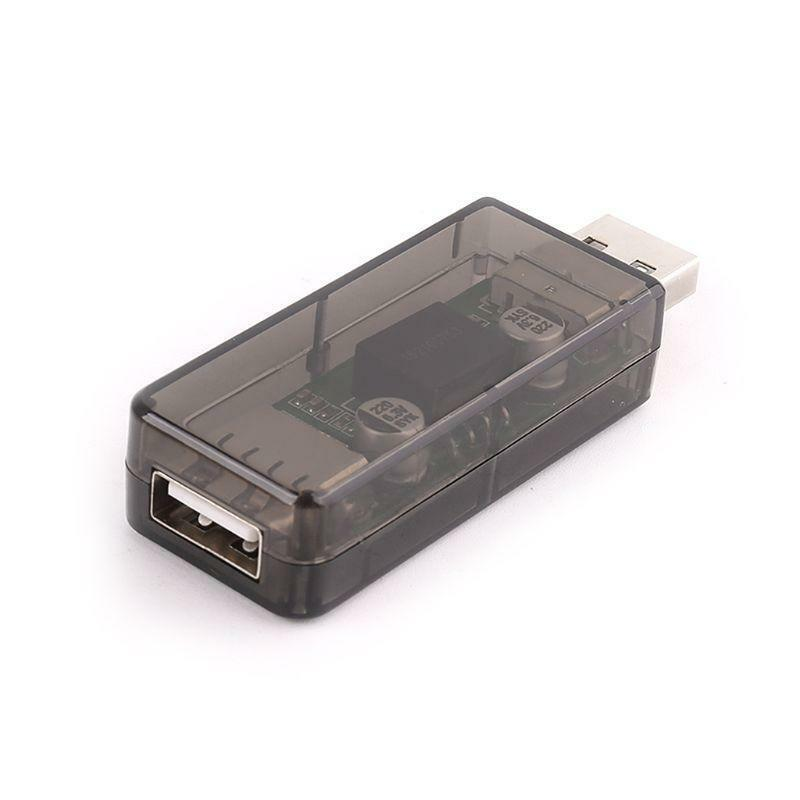

<a name="readme-top"></a>

[![Issues][issues-shield]][issues-url]
[![MIT License][license-shield]][license-url]

<br />
<div align="center">

<h3 align="center">OpenBafangTool</h3>

  <p align="center">
    Open-source e-bike Configuration&Diagnostics software - tune any kind of your Bafang device - M500, M510, M600, M420, BBS01, BBS02, BBSHD, display or any other
    <br />
    <a href="docs"><strong>Explore the docs</strong></a>
    <br />
    <br />
    <a href="https://github.com/andrey-pr/OpenBafangTool/releases">Releases</a>
    ·
    <a href="https://github.com/andrey-pr/OpenBafangTool/issues">Report Bug</a>
    ·
    <a href="https://github.com/andrey-pr/OpenBafangTool/issues">Request Feature</a>
  </p>
</div>

<!-- SUPPORTED HARDWARE -->
## Supported Hardware



All kinds of modern bafang hardware with CAN bus are supported: all mid-drive motors, all hub motors with bafang controller, all displays and all digital torque sensors, as well as all kinds of motors with UART (but not displays with UART).

Also, you may encount bafang electrics with label of other brand: I tested motors branded for Qwic and AEG, also there is information about bafangs branded for Prophete, E-Novation and Blaupunkt (but I not tested them).

Important notices:
1. Some devices have firmware with limited configurable parameters, and it does not depends on model. For example, I tested 3 absolutely same M420 mid-drives, and two of them have all configurable paramters available, and one of them does not have most of parameters.
2. If you have bike with bafang hub motor, check brand of it's controller: some bike manufacturers may install bafang hub motor with third-party controller.
3. Sub-brands usually also have branded motors from other manufacturers; some of sub-branded models are non-bafang, so you need to search information right for model of your device.

<!-- RELEASE NOTES -->
## Release Notes

### 2.2.2

- Added config for speed in "walk mode" for can systems
- Added config for magnet number for uart systems
- Started to add support of multi-language interface

### 2.2.1

- Added support of bafang digital batteries (please note that not all of batteries installed on bike are digital; bafang motors could work with simple batteries with no digital interface)

### 2.1.1

- Added support of more configurable parameters

### 2.0.1

- Fixed bug with writing

### 2.0.0

- Added support of new systems with CAN bus

### 1.0.1

- Published project in Beta
- Added Simplified Mode for beginners

### 1.0.0

- Published first version in Alpha

<!-- ABOUT THE PROJECT -->
## About The Project





**Warning! This project in beta version, so use it carefully. If you have any problems, write in [Issues](https://github.com/andrey-pr/OpenBafangTool/issues)**

**Please report about your expirience of using this program on [forum](https://endless-sphere.com/sphere/threads/openbafangtool-new-open-source-bafang-configuration-tool.122809) to help me make programm better**

The goal of project is to replace official diagnostic tools for ebikes, that available only for official dealers, with open source alternative to let people repair and configure their bikes at home. For example, you can read and erase error codes, or limit power if physical power of your motor is too big for your country rules (possibilities depend on motor brand and model). Second goal of project is to document protocols of as much systems as possible to let other developers use them in their projects.

Currently this program supports any kinds of Bafang - motors with UART (BBS01, BBS02, etc) and with CAN (M500, M600, M420, etc). Currently not all features of CAN motors are supported, more features will be available in next versions.

<p align="right">(<a href="#readme-top">back to top</a>)</p>

<!-- GETTING STARTED -->
## Getting Started

You can download executables for Windows and Linux (AppImage) [here](https://github.com/andrey-pr/OpenBafangTool/releases)

### Prerequisites

#### Minimal set of hardware that you need to use this program for motors with CAN (also possible to test program in demo mode without real hardware):



Official Bafang BESST Tool device - you can buy it in many shops for 150\$ or sometimes for 100\$. In the future program will support cheap Canable hardware, that costs from 10\$ to 20\$.



Motor that you want to configure. 

#### Minimal set of hardware that you need to use this program for motors with UART (also possible to test program in demo mode without real hardware):



Programming cable for bafang - you can buy it on Aliexpress for 5$ or in local shops.


Motor that you want to configure.



Also better to have USB isolator, that will protect your computer in case when motor or connection cable is broken and put battery voltage (usually 36V or 48V) on USB connector.

### Installation

Current build of program are portable, so just download executable and launch it. Also, if you use Linux, you may need to unblock your serial ports or hid device in way, dependent on your distributive.

#### For CAN

##### HID troubleshooting on Linux

Many Linux distros, such as Ubuntu, blocks direct access to HID device. To fix it, do next things:
1. Create file `/etc/udev/rules.d/51-bessttool.rules` (name may be different, but compatible with udev).
2. Write following content in file (if pid or vid if different on your device, change it in file):
   ```
   SUBSYSTEM=="input", GROUP="input", MODE="---rw-rw-rw-"
   SUBSYSTEM=="usb", ATTRS{idVendor}=="0323", ATTRS{idProduct}=="0627", MODE:="rw-rw-rw-", GROUP="plugdev"
   KERNEL=="hidraw*", ATTRS{idVendor}=="0323", ATTRS{idProduct}=="0627", MODE="---rw-rw-rw-", GROUP="plugdev"
   ```
3. Execute folowing command: `sudo udevadm control --reload-rules`
4. Replug your device

#### For UART
Connection error might occur if connecting to the serial port needs elevated privileges (experienced on Fedora 40 and kubuntu 24.04).

1. Check device permissions the following command `ls -la /path/to/your/serial/device`
```
$ ls -la /dev/ttyUSB0
crw-rw----. 1 root dialout 188, 0 Jul  9 17:55 /dev/ttyUSB0
```
2. in he case above, device belongs to root, and is accessible to members of group dialout. To access it without elevated privilieges, you need to add your linux user to the dialout group with `sudo usermod -a -G dialout yourusername`.
3. Reboot your computer to apply changes.

<p align="right">(<a href="#readme-top">back to top</a>)</p>

<!-- USAGE EXAMPLES -->
## Usage

There are docs on each parameter in program or you can use any manual from internet. Here is some examples what you can do with this parameters (some of examples related not to all kind of hardware):

1. You can set wheel size when you want to install motor kit on your bike, to show correct speed on display.
2. You can change value on odometer on display if you want to replace display on existing bike or install used display on new bike.
3. According user reports, some motor modifications starts only after one full pedal rotation - in that case, you can lower parameter "Signal No." to start motor after quarter of rotation or less.
4. You can use error codes and diagnostic data from onboard sensors to physically repair your motor.

<p align="right">(<a href="#readme-top">back to top</a>)</p>

<!-- ROADMAP -->
## Roadmap

- [ ] Add support of Bafang motors with UART
  - [x] Find hardware
  - [x] Alpha
  - [x] Beta
  - [ ] Stable
- [ ] Add support of Bafang systems with CAN
  - [x] Find hardware
  - [x] Alpha
  - [ ] Beta
  - [ ] Stable
  - [ ] Add more channgeable parameters
- [ ] Add support of Bafang displays with UART
- [ ] Add more kinds of executables
  - [x] .dmg - MacOS, on Apple Silicon and x86_64
  - [ ] Flatpak - Linux, x86_64 - in progress
- [ ] Add multi-language interface
- [x] Add simple mode for beginners
- [ ] Add support of cheap Canable USB-CAN convertrs

You can open [issue](https://github.com/andrey-pr/OpenBafangTool/issues) for request a new feature.

<p align="right">(<a href="#readme-top">back to top</a>)</p>

<!-- LICENSE -->
## License

Distributed under the MIT License. See `LICENSE.txt` for more information.

<p align="right">(<a href="#readme-top">back to top</a>)</p>

<!-- CONTACT -->
## Contact

[Forum topic](https://endless-sphere.com/sphere/threads/openbafangtool-new-open-source-bafang-configuration-tool.122809)

[Issues](https://github.com/andrey-pr/OpenBafangTool/issues)

Project Link: [https://github.com/andrey-pr/OpenBafangTool](https://github.com/andrey-pr/OpenBafangTool)

<p align="right">(<a href="#readme-top">back to top</a>)</p>

<!-- ACKNOWLEDGMENTS -->
## Acknowledgments

* [Stefan Penoff - author of original Bafang Configuration Tool project](https://penoff.me/2016/01/13/e-bike-conversion-software/)
* [Tomblarom - project consultant and my good friend](https://github.com/Tomblarom)
* [ Bafang_M500_M600 - project, that made a big research about bafang CAN protocol](https://github.com/OpenSourceEBike/Bafang_M500_M600)

<p align="right">(<a href="#readme-top">back to top</a>)</p>

<!-- MARKDOWN LINKS & IMAGES -->
<!-- https://www.markdownguide.org/basic-syntax/#reference-style-links -->
[issues-shield]: https://img.shields.io/github/issues/andrey-pr/OpenBafangTool.svg?style=for-the-badge
[issues-url]: https://github.com/andrey-pr/OpenBafangTool/issues
[license-shield]: https://img.shields.io/github/license/andrey-pr/OpenBafangTool.svg?style=for-the-badge
[license-url]: LICENSE.txt
